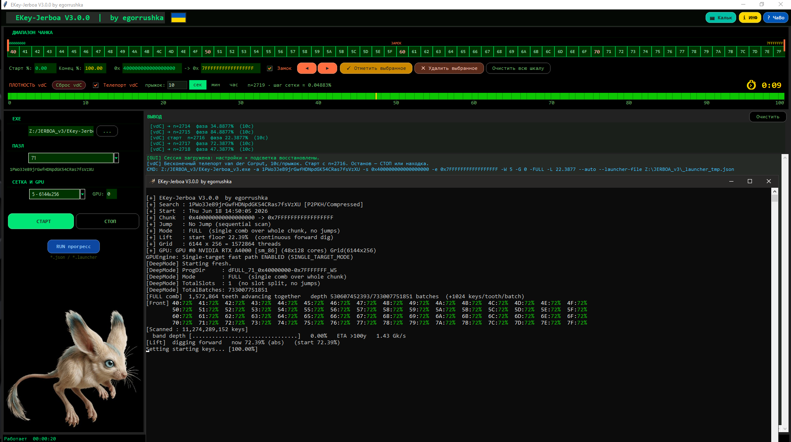

<div align="center">


# 🦘 EKey-Jerboa **V3.0.0**
Инструмент предназначен для законных открытых задач Bitcoin Puzzle и исследований. Используйте ответственно.
### GPU-перебор приватных ключей Bitcoin Puzzle — *базируется на Jerboa v2.0.0, дополнено режимом vdC-телепорта*

[](#)
[](#)
[](LICENSE)
[](#)
[](#)
[](https://github.com/JeanLucPons/VanitySearch)
[](#)

</div>

---

<div align="center">



<sub><i>Замените <code>docs/screenshot.png</code> реальным скриншотом лаунчера.</i></sub>

</div>

---

## 📖 Что это

**EKey-Jerboa** — это инструмент перебора приватных ключей на GPU для открытых задач **Bitcoin Puzzle** (в первую очередь — пазл №71). Задаёте целевой P2PKH-адрес (или сжатый публичный ключ) и диапазон («чанк») — программа прогоняет этот диапазон на видеокарте, ищет совпадающий приватный ключ и сохраняет прогресс, чтобы поиск можно было ставить на паузу и продолжать.

Криптография — **secp256k1** (та же кривая, что у Bitcoin), вся тяжёлая работа идёт на GPU через **CUDA**. Проект — форк [VanitySearch](https://github.com/JeanLucPons/VanitySearch) Жан-Люка Понса (GPLv3).

> Текущая версия — **EKey-Jerboa V3.0.0**. Она **базируется на Jerboa v2.0.0** (классический движок-предшественник) и дополнена главным новым режимом: **бесконечным vdC-телепортом** поверх синхронной «расчёски» на весь диапазон, управляемым из графического лаунчера.

---

## ✨ Что нового в этой версии

| | Возможность |
|---|---|
| 🆕 | **vdC-телепорт** — бесконечная низкодискрепансная развёртка по глубине (главное нововведение) |
| 🪮 | **FULL «расчёска»** — один гребень из **1 572 864** потоков покрывает весь чанк сразу |
| 🔌 | **Протокол `autocmd`** — лаунчер рулит движком через файл, без перезапуска консоли |
| 💾 | **Resume по фазам** — продолжение поиска по счётчику `n` из `vdc_gpu0.json` |
| 🎛 | **Графический лаунчер** — шкала диапазона, карта покрытия, шкала плотности vdC, калькулятор времени, окна **ИНФ/ЧаВо** |

---

## 🧠 Как работает vdC-телепорт

<details open>
<summary><b>1. «Расчёска» — горизонталь (старшие символы)</b></summary>

<br>

Вместо нарезки чанка на куски движок кладёт на **весь** диапазон один гребень из **1 572 864** зубцов (потоков GPU). Диапазон делится на столько же равных регионов, и каждый зубец «изолированно» перебирает свой регион:

```
stepThread = (ksFinish - ksStart + 1) / numThreads      // ширина региона зубца
key = ksStart + thId*stepThread + batch*STEP_SIZE + j   // ключ зубца thId
```

* **старшие ~5–6 hex-символов** раздаются по зубцам и перебираются **параллельно**, все сразу;
* **младшие ~11–12 символов** — это **последовательный** счётчик внутри каждого зубца (несущая оптимизация: подряд идущие точки считаются батч-инверсией Монтгомери — отсюда гигаключи/с).

Горизонталь покрыта **полностью и всегда** — по одной точке в каждом регионе на любой момент времени.

</details>

<details open>
<summary><b>2. vdC — вертикаль (глубина 0…100%)</b></summary>

<br>

«Фронт» — это общий `offset` всех зубцов: тонкая линия, протыкающая все регионы на одной глубине. Двигать его просто вниз (0→100%) плохо: остановка покрыла бы только верхушку. Поэтому фронт **прыгает** по последовательности ван дер Корпута (база 2):

```
0% → 50% → 25% → 75% → 12.5% → 62.5% → 37.5% → 87.5% → …
```

Каждый следующий шаг **делит пополам самый большой незакрытый зазор**. После `2^k` фаз — идеально ровная сетка с шагом `1/2^k`. Это минимальная дискрепансия: **на любой остановке** глубина прощупана максимально равномерно, без слепых зон, и сетка густеет бесконечно.

> ⚖️ **Важно:** порядок обхода **не меняет вероятность** найти ключ — `P = N/M` зависит только от числа проверенных ключей. vdC даёт не больше шанса, а **честно-ровную** выборку при остановке в любой момент.

</details>

<details>
<summary><b>3. Протокол: лаунчер ↔ движок</b></summary>

<br>

Лаунчер и движок — **разные процессы**. Лаунчер стартует движок один раз (с `--auto`) и дальше рулит им через файл, без перезапуска консоли на каждый прыжок:

1. Лаунчер считает `phase = vdc(n)`, затем `n += 1`.
2. **Атомарно** пишет `autocmd_gpu0.txt` → три числа: `<seq> <pct> <stop>`.
3. Движок (`--auto`) опрашивает файл ~3 раза/сек; при новом `seq` ставит `liftFrom = pct`, `batchCount = (pct/100)·totalBatches` и телепортирует **всю расчёску** на новую глубину.

Движок не знает слова «vdC» — он получает «прыгни на X%». Стратегию знает только лаунчер. **Лаунчер = стратегия, движок = исполнение.**

</details>

---

## 🛠 Компиляция под Windows

> Нужны **CUDA Toolkit** и **Visual Studio Build Tools** (тестировалось на CUDA 13.1 + VS2022).

```bat
:: из корня проекта — просто запустите готовый скрипт:
compile_modern.bat
```

На выходе — **`EKey-Jerboa.exe`**. Скрипт сам подбирает архитектуры (sm_75 / sm_86 / sm_89 + PTX-fallback для новых карт) и включает SSE/ADX/BMI для CPU-хеширования.

<details>
<summary><b>🐧 Сборка под Linux</b></summary>

<br>

```bash
make            # или: make -j$(nproc)

# при необходимости переопределить:
make GENCODE="-gencode arch=compute_86,code=sm_86"
make CUDA_PATH=/usr/local/cuda-13.1
```

Исходники кросс-платформенные — править ничего не нужно.

</details>

---

## 🚀 Запуск и опции CLI

```bash
EKey-Jerboa.exe -a <address> -s 0xSTART -e 0xEND -W 5 -G 0 -b --auto
```

| Опция | Назначение |
|---|---|
| `-a <addr>` | Целевой P2PKH-адрес (сжатый) |
| `-p <pubkey>` | Целевой сжатый публичный ключ |
| `-s` / `-e` | Начало / конец чанка (`0x…`) |
| `-r <bits>` | Сокращение диапазона (напр. `-r 71`) |
| `-T <сек>` | Интервал прыжка (Deep-режим), `999999999` = слот до конца |
| `-G <id>` | Номер GPU |
| `-W <0-7>` | Профиль грида: `0=auto`, `5=6144×256` (по умолч.), `7=12288×256` |
| `-b` | Сохранять / продолжать прогресс |
| `-D4..-D6` | Deep — более глубокая нарезка на слоты (`-D3` по умолч.) |
| `-FULL` / `-L <%>` | FULL-расчёска / Lift с заданной глубины |
| `--auto` | Слушать `autocmd_gpuN.txt` (vdC-телепорт от лаунчера) |
| `-faq` / `-inf` | Полное руководство / версия и авторы |

---

## 🎛 Лаунчер

Лаунчер — это «пульт»: вы задаёте чанк и параметры, а он собирает командную строку и запускает движок в отдельной консоли. Сам перебор делает скомпилированный движок.

<table>
<tr><td>📏</td><td><b>Верхняя шкала диапазона</b> — выбор чанка ползунками / в hex; замок и стрелки ◀▶ шагают кусками своей ширины.</td></tr>
<tr><td>🟩</td><td><b>Карта покрытия</b> (3 кнопки) — пометить / снять / очистить пройденные куски (свой файл на каждый пазл).</td></tr>
<tr><td>🌈</td><td><b>Шкала плотности vdC</b> — накопленные проколы телепорта в <b>3 зелёных оттенках</b> по октаве (глубина «нарастает»), жёлтая бегущая фаза, счётчик <code>n</code> и шаг сетки.</td></tr>
<tr><td>⏱</td><td><b>Контролы телепорта</b> — интервал прыжка (сек/мин/час, до 100 ч) и обратный отсчёт до следующего прыжка.</td></tr>
<tr><td>🧮</td><td><b>Калькулятор времени</b> — оценка времени перебора (GKey/TKey, скорость, деление на N слотов).</td></tr>
<tr><td>▶️</td><td><b>START / STOP / RUN progress</b> — запуск, остановка и загрузка рабочего чанка (восстанавливает пазл, диапазон, GPU, интервал, чекбоксы, слоты и счётчик <code>n</code>).</td></tr>
</table>

> 💡 **В лаунчере уже куча справки.** Кнопки **`i ИНФ`** и **`? ЧаВо`** открывают встроенные окна с подробным описанием: принцип расчёски, как работает vdC, что значат строки в консоли (`[Front]`, `[Lift] now X% (start Y%)`, `Setting starting keys 100%` = «прыжок произошёл»), как устроен resume по фазам и многое другое. Те же 24 раздела доступны в движке через `-faq`, версия и авторство — через `-inf`.

---

## 📁 Файлы прогресса

| Файл | Где | Что |
|---|---|---|
| `vdc_gpu0.json` | папка чанка | счётчик `n` + снимок настроек (на каждый прыжок обновляется только `n`) |
| `autocmd_gpu0.txt` | папка чанка | команда телепорта `<seq> <pct> <stop>` |
| `deep_*.json` | папка чанка | тонкий прогресс (только с `-b`) |
| `coverage_puzzleN.json` | рядом с exe | ручная карта покрытия пазла |

Папка FULL-режима: `dFULL_{пазл}_0x{lo}-0x{hi}_W{грид}/` &nbsp;·&nbsp; Deep: `d{N}_{пазл}_…_W{грид}_rnd/` — разные флаги = разные папки = без конфликтов.

---

## 📊 Производительность

* Замер: **~1.47 Gk/s** на **NVIDIA RTX A4000** (sm_86), CUDA 13.1.
* Ключевые ускорения: батч-инверсия Монтгомери на группу точек, инлайн SHA256 + RIPEMD160 на GPU, эндоморфизм/симметрия кривой из ядра VanitySearch, один целевой хеш в constant-памяти.

> ⚠️ Масштаб честно: полный чанк пазла 71 ≈ 2⁷⁰ ключей — пройти его целиком невозможно. Реальные рычаги — скорость (N) и сужение диапазона (M); vdC лишь делает покрытие максимально ровным при остановке.

---

## ⚖️ Лицензия

Проект распространяется под **GNU General Public License v3.0** — см. [LICENSE](LICENSE).
Форк [VanitySearch](https://github.com/JeanLucPons/VanitySearch), оригинал © Jean Luc PONS (GPLv3). Уведомления об авторстве и лицензии сохранены.

---

## 🙏 Авторство и благодарности

* **Автор форка:** [egorrushka](https://github.com/egorrushka)
* **Программирование:** Claude (Anthropic) под руководством и по архитектуре egorrushka.
* **Основано на:** VanitySearch © Jean Luc PONS.
* **Сделано в Украине** 🇺🇦, в условиях войны, в славном городе **Чернигове**.
* 📧 Связь и вопросы: **egor.gr1@gmail.com**

---

## ⚠️ Дисклеймер

Инструмент предназначен для законных открытых задач **Bitcoin Puzzle** и исследований. Используйте ответственно.
